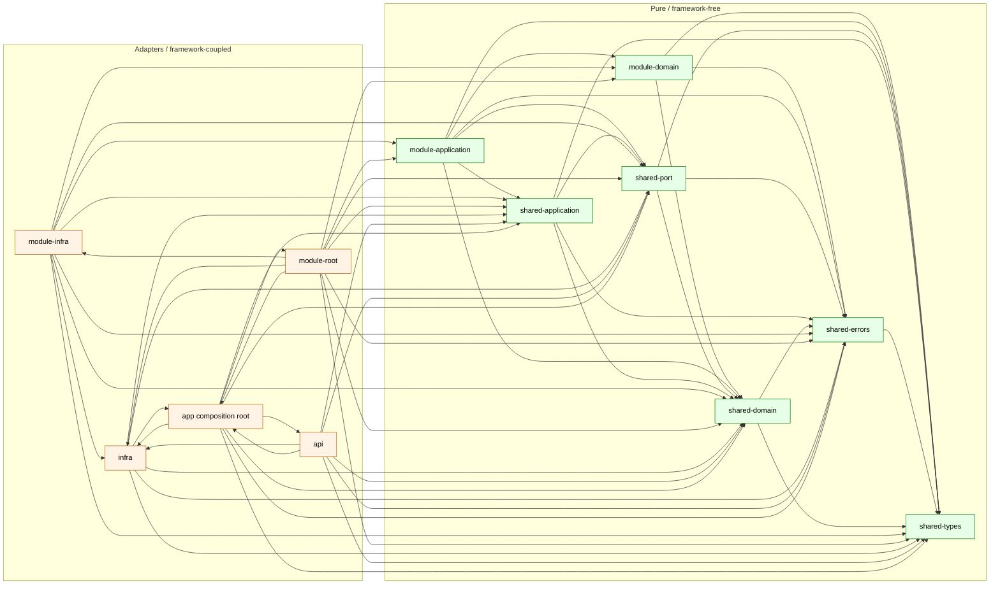

# Architecture rules

This repository follows **Clean Architecture + Domain-Driven Design +
Hexagonal (Ports & Adapters)**. The rules below are enforced
mechanically by `backend-node/tools/check-boundaries.ts` and run in CI
(`.github/workflows/architecture.yml`). Any PR that violates them fails
the build.

> Rule of thumb: the direction of dependency always points **inward**,
> toward the domain. The domain depends on nothing; the framework
> depends on the domain.

---

## 1. Layers

Every file under `backend-node/src/` is classified into exactly one
layer based on its path:

| Path pattern                                   | Layer                | Purpose                                                                    |
| ---------------------------------------------- | -------------------- | -------------------------------------------------------------------------- |
| `src/modules/<name>/domain/**`                 | `module-domain`      | Entities, value objects, domain services, repository **ports**.            |
| `src/modules/<name>/application/**`            | `module-application` | Use cases / orchestrators. Depend on domain and ports only.                |
| `src/modules/<name>/infra/**`                  | `module-infra`       | Driven adapters: repositories, HTTP routes, clients.                       |
| `src/modules/<name>/index.ts`                  | `module-root`        | The module's composition root (`registerModule(app)` plugin).              |
| `src/shared/application/ports/**`              | `shared-port`        | Cross-cutting ports (clock, uuid, logger, event-bus, queue, tx, inbox).    |
| `src/shared/application/**`                    | `shared-application` | Cross-cutting application helpers that speak in terms of ports.            |
| `src/shared/types/**`                          | `shared-types`       | Generic type kernels (`Result`, `Brand`, etc.). Pure.                      |
| `src/shared/errors/**`                         | `shared-errors`      | `AppError`, `ErrorCode`. Pure — no framework imports.                      |
| `src/shared/domain/**` *(reserved)*            | `shared-domain`      | Cross-module domain kernel. Reserved; empty today.                         |
| `src/infra/**`                                 | `infra`              | Project-wide driven adapters: db pool, cache, event bus, migrations, etc.  |
| `src/api/**`                                   | `api`                | Driving adapter: HTTP framework glue (controllers, routes, error-handler). |
| `src/app/**`                                   | `app`                | Composition root: config loader, container, server build, lifecycle.       |

---

## 2. Dependency matrix (allowed imports)

An arrow `A → B` means "files in layer A may import files in layer B".

| From \ To               | m-domain | m-app | m-infra | m-root | s-port | s-app | s-types | s-errors | s-domain | infra | api | app |
| ----------------------- | -------- | ----- | ------- | ------ | ------ | ----- | ------- | -------- | -------- | ----- | --- | --- |
| **module-domain**       | ✓ own    |  ✗    |  ✗      |  ✗     |  ✗     |  ✗    |  ✓      |  ✓       |  ✓       |  ✗    |  ✗  |  ✗  |
| **module-application**  | ✓ own    | ✓ own |  ✗      |  ✗     |  ✓     |  ✓    |  ✓      |  ✓       |  ✓       |  ✗    |  ✗  |  ✗  |
| **module-infra**        | ✓ own    | ✓ own | ✓ own   |  ✗     |  ✓     |  ✓    |  ✓      |  ✓       |  ✓       |  ✓    |  ✗  |  ✗  |
| **module-root**         | ✓ own    | ✓ own | ✓ own   | ✓ own  |  ✓     |  ✓    |  ✓      |  ✓       |  ✓       |  ✓    |  ✗  |  ✓  |
| **shared-port**         |  ✗       |  ✗    |  ✗      |  ✗     |  ✓     |  ✗    |  ✓      |  ✓       |  ✓       |  ✗    |  ✗  |  ✗  |
| **shared-application**  |  ✗       |  ✗    |  ✗      |  ✗     |  ✓     |  ✓    |  ✓      |  ✓       |  ✓       |  ✗    |  ✗  |  ✗  |
| **shared-types**        |  ✗       |  ✗    |  ✗      |  ✗     |  ✗     |  ✗    |  ✓      |  ✗       |  ✗       |  ✗    |  ✗  |  ✗  |
| **shared-errors**       |  ✗       |  ✗    |  ✗      |  ✗     |  ✗     |  ✗    |  ✓      |  ✓       |  ✗       |  ✗    |  ✗  |  ✗  |
| **shared-domain**       |  ✗       |  ✗    |  ✗      |  ✗     |  ✗     |  ✗    |  ✓      |  ✓       |  ✓       |  ✗    |  ✗  |  ✗  |
| **infra**               |  ✗       |  ✗    |  ✗      |  ✗     |  ✓     |  ✓    |  ✓      |  ✓       |  ✓       |  ✓    |  ✗  |  ✓¹ |
| **api**                 |  ✗       |  ✗    |  ✗      |  ✗     |  ✓     |  ✓    |  ✓      |  ✓       |  ✓       |  ✓    |  ✓  |  ✓  |
| **app**                 |  ✗       |  ✗    |  ✗      |  ✓     |  ✓     |  ✓    |  ✓      |  ✓       |  ✓       |  ✓    |  ✓  |  ✓  |

¹ `infra` may import **only** `app/config.ts` — for the validated `Config`
type. It must not import the container, server build, or lifecycle.

"Own" means: files in `modules/X` may only import files in `modules/X`;
they may never reach into `modules/Y`.

### Dependency graph (mermaid)



**Read this as:** arrows point from a dependent layer to its allowed
dependencies. Green nodes are framework-free; orange nodes are free to
import drivers (pg, redis, fastify, etc.). No arrow crosses from orange
into green (except through ports defined in the green half).

---

## 3. Hard rules (never violated)

1. **Domain is pure.** `module-domain`, `shared-port`, `shared-types`,
   `shared-errors`, `shared-domain` may not import any framework /
   driver package (`fastify`, `@fastify/*`, `pg`, `ioredis`, `pino`,
   `dotenv`, `redis`, `bullmq`). Only `node:*` built-ins and `zod` are
   always permitted.
2. **Application is framework-free.** `module-application` and
   `shared-application` never import Fastify, pg, ioredis, pino, etc.
   They speak exclusively through ports defined in
   `shared/application/ports/` or a module's `domain/`.
3. **Ports live with the consumer.** Cross-cutting ports live in
   `src/shared/application/ports/`. Per-module ports (e.g.
   `ExampleRepository`) live in that module's `domain/`.
4. **Adapters live with the framework.** Every concrete implementation
   of a port — in-memory, pg, redis, fastify, bullmq — lives under
   `src/infra/` or `src/modules/<name>/infra/`.
5. **Modules do not import each other.** `modules/A/**` may not import
   `modules/B/**`, period. Cross-module communication uses the **event
   bus** or the **outbox**. A module opens its surface via events and
   its `index.ts` plugin; nothing else.
6. **Composition happens in `app/`.** The dependency container,
   `app/dependency-container.ts`, is the only place that constructs
   concrete adapters. Routes, modules, and use cases receive ports via
   `app.ctx` (the application context) or constructor injection.
7. **No `process.env` outside `app/config.ts`.** Environment access is
   centralised so tests can substitute configuration deterministically.

---

## 4. Module layout (template)

```
modules/<name>/
├─ domain/           entities, VOs, domain services, repository PORTS
├─ application/      use cases (depend on domain + shared/application/ports)
├─ infra/            driven adapters: repository impls, HTTP routes, clients
└─ index.ts          composition: registerModule(app) Fastify plugin
```

See `backend-node/src/modules/_template/` for a working reference.

To add a new bounded context:

```bash
cp -r backend-node/src/modules/_template backend-node/src/modules/<name>
# 1. rename symbols
# 2. register in src/app/register-modules.ts
# 3. `npm run check:boundaries && npm run typecheck && npm test`
```

---

## 5. Enforcement

### Local

```bash
cd backend-node
npm run check:boundaries   # ✓ no boundary violations
npm run check:arch         # boundaries + typecheck
npm run lint               # biome (style + dead-code safety-net)
npm test                   # all unit / integration tests
```

`check-boundaries.ts` walks every `.ts` file under `src/`, classifies
it by path, parses its imports, and compares each import against the
rule matrix above. It exits:

- `0` — no violations.
- `1` — one or more violations (printed with `file:line`).
- `2` — internal error (unrecognised layer, unresolvable import).

### CI

`.github/workflows/architecture.yml` runs on every push and PR and
enforces the architecture as three hard gates:

1. `npm run check:boundaries` — fails fast on layer / module /
   framework-coupling violations.
2. `npm run typecheck` — catches structural breakage the regex-based
   boundary checker cannot see.
3. `npm test` — runs the full Vitest suite, including
   `tools/check-boundaries.test.ts` which freezes the checker's own
   behaviour.

Code style (Biome `npm run lint`) is a separate, non-architectural CI
pipeline so style debt cannot block an architectural PR and vice versa.

A PR cannot merge unless all three architecture gates pass.

---

## 6. Extending the rules

When you add a layer, update **two** places together:

1. `backend-node/tools/check-boundaries.ts` — classifier + matrix.
2. `architecture.md` — the tables in sections 1 and 2.

The boundary checker is the source of truth; `architecture.md` is its
human-readable mirror.
